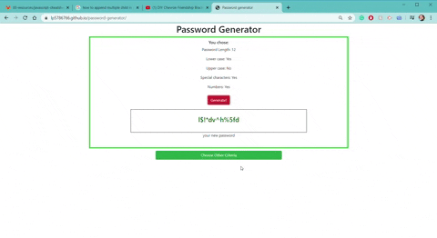

# password-generator

A simple and efficient random password generator, built using Bootstrap grid.

## Steps

### The generator will ask you a series of questions:

1. How lond is the password?
2. Do you want to use lower case letters?
3. Do you want to use upper case letters?
4. Do you want to use special characters?
5. Do you want to use numbers?

### The chosen options will be displayed on the page.

Click "Generate!" to get your password
Click again to generate a new password if you don't like the current with the same criteria.

### Refresh the page to start over.

Click "Choose New Criteria" to refresh and start the process of choosing new password criteria.

## Link to the Password Generator:

https://lp5786766.github.io/password-generator/

## Credits:
-[Luba Pecheneva](https://github.com/lp5786766)
